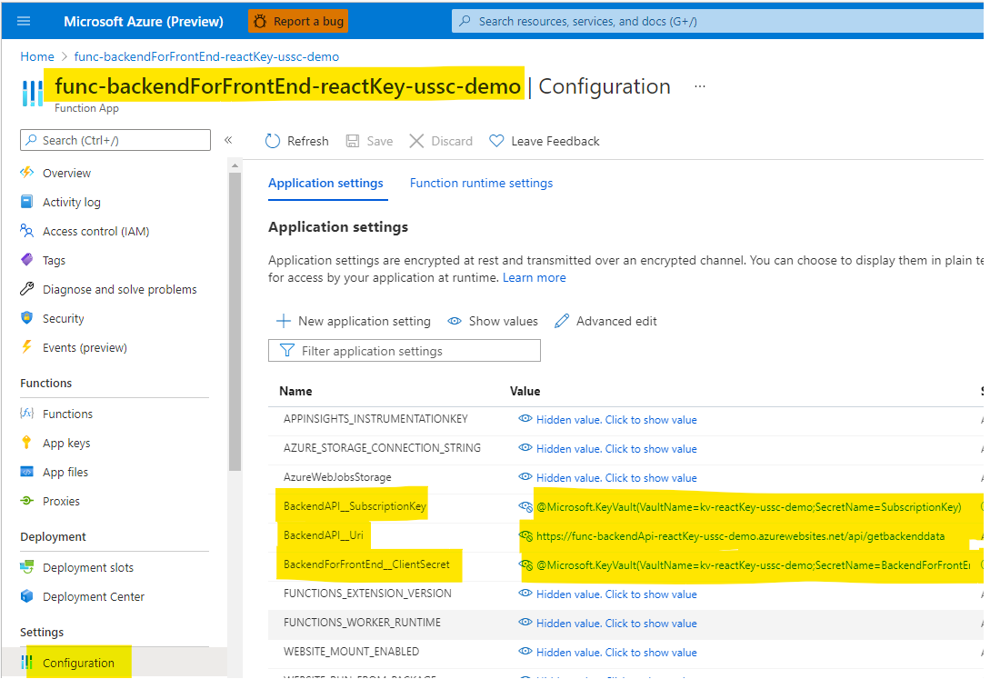

# func-reset-key

This repo shows how to use an [Azure Function](https://docs.microsoft.com/en-us/azure/azure-functions/) to regenerate or set the primary & secondary keys of an [Azure API Management](https://docs.microsoft.com/en-us/azure/api-management/) (APIM) subscription programatically.

It also shows how to implement a "backend-for-frontend" pattern for protecting an API subscription key when using a Single Page App (React).

## How to regenerate APIM subscription keys


In this case we want to programatically change the API Management subscription key. APIM doesn't have a built-in way to rotate keys on a periodic basis, but we can write one ourseves.

Our **client** (an Azure Function) needs an identity (service principal) in the same AAD tenant where our APIM is hosted. We need to grant that service principal access to request a token from the **Service Management API's** service principal. We can then pass that token to our [APIM's Management REST API](https://docs.microsoft.com/en-us/rest/api/apimanagement/2020-12-01/subscription/regenerate-primary-key), which will validate the token and authorize updating the key.

### How to authenticate

First, we need to grant the service principal of our Azure Function (the client) access to the Service Management API. This is done through the App Registration blade in Azure AD. Click on the **API permissions** blade and then click on **Add a permission**. You can then select the **Azure Service Management** API and the specific scope you want (in this case, the **user_impersonation** scope). This will allow the client service principal to get an access token to the Service Management API.


Second, you need to grant the client service principal access to your specific APIM. You can do this on the **Access Control** blade of the APIM. Click on **Add** and grant your client service principal the **[API Management Service Contributor](https://docs.microsoft.com/en-us/azure/api-management/api-management-role-based-access-control#built-in-roles)** RBAC role.


You can now request a token to the Service Management API and submit it to the APIM Management REST API. There are 2 methods in the `/update-primary-key/UpdateApimKeys.cs` file, one to regenerate the key & one to allow you to set it to something specific.

In the constructor of the Azure Function, we need to initialize the `ConfidentialClientApplication` so it can request a token. The **client_id**, **client_secret**, etc are pulled from the Azure Function configuration.

```csharp
public UpdateApimKeys() {
  confidentialClientApplication = ConfidentialClientApplicationBuilder.Create(System.Environment.GetEnvironmentVariable("AzureAD__ClientID"))
    .WithClientSecret(System.Environment.GetEnvironmentVariable("AzureAD__ClientSecret"))
    .WithAuthority(new Uri($"{System.Environment.GetEnvironmentVariable("AzureAD__Instance")}/{System.Environment.GetEnvironmentVariable("AzureAD__Tenant")}"))
    .Build();
  ...
```

In the `RegeneratePrimaryKey` function, we need to get an access token from the client service principal to the Service Management API resource.

```csharp
var tokenResult = await confidentialClientApplication.AcquireTokenForClient(new List<string>{"https://management.azure.com/.default"}).ExecuteAsync();
```

We can now either regenerate the API subscription primary key or set it to a specific value.

```csharp
using(var requestMessage = new HttpRequestMessage(HttpMethod.Post, $"{APIM_MANAGEMENT_ENDPOINT}/regeneratePrimaryKey?api-version=2020-12-01")) {
  requestMessage.Headers.Authorization = new AuthenticationHeaderValue("Bearer", tokenResult.AccessToken);

  var apimRegeneratePrimaryKeyResult = await httpClient.SendAsync(requestMessage);
```

## Protecting API subscription key


### Backend setup

#### Azure Function setup


### Backend for front-end setup

#### Azure AD app registration setup


#### Azure Function setup




### Front-end setup

#### Azure AD app registration setup


## KeyVault setup


## Useful REST API calls

### Request access token

```shell
POST https://login.microsoftonline.com/microsoft.onmicrosoft.com/oauth2/v2.0/token
```

### Regenerate primary key

```shell
POST https://management.azure.com/subscriptions/dcf66641-6312-4ee1-b296-723bb0a999ba/resourceGroups/rg-apim-ussc-demo/providers/Microsoft.ApiManagement/service/apim-dev-ussc-demo/subscriptions/6169bbb8a952b1005f070001/regeneratePrimaryKey?api-version=2020-12-01
```

### Set primary key

```shell
PATCH https://management.azure.com/subscriptions/dcf66641-6312-4ee1-b296-723bb0a999ba/resourceGroups/rg-apim-ussc-demo/providers/Microsoft.ApiManagement/service/apim-dev-ussc-demo/subscriptions/6169bbb8a952b1005f070001?api-version=2020-12-01

{
    "properties": {
        "primaryKey": "asdf",
        "secondaryKey": "fdas"
    }
}
```

## Resources

- https://docs.microsoft.com/en-us/azure/active-directory/develop/v2-oauth2-auth-code-flow
- https://docs.microsoft.com/en-us/azure/active-directory/develop/v2-oauth2-client-creds-grant-flow
- https://docs.microsoft.com/en-us/rest/api/apimanagement/2020-12-01/subscription/regenerate-primary-key
- https://docs.microsoft.com/en-us/azure/active-directory/develop/scenario-spa-acquire-token?tabs=javascript2
- https://docs.microsoft.com/en-us/azure/api-management/howto-protect-backend-frontend-azure-ad-b2c
- https://docs.microsoft.com/en-us/azure/active-directory/develop/msal-overview
- https://docs.microsoft.com/en-us/azure/api-management/api-management-role-based-access-control#built-in-roles