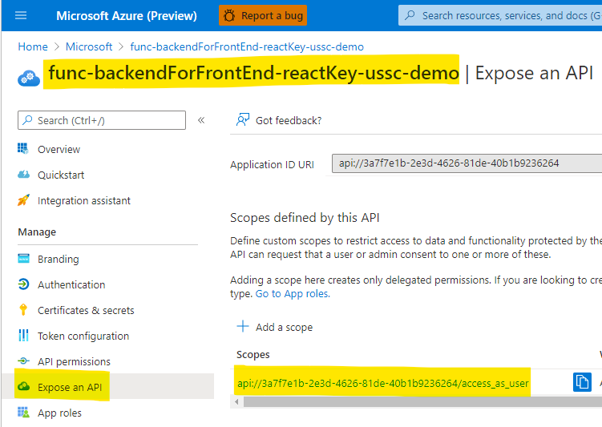
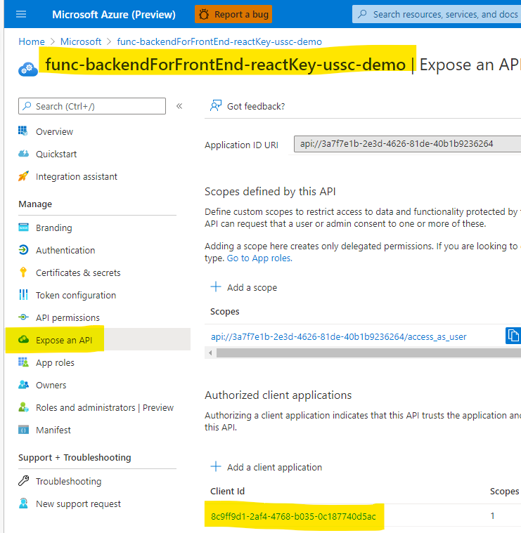

# func-reset-key

This repo shows how to how to implement a "backend-for-frontend" pattern for protecting an API subscription key when using a Single Page App (React).

It also shows how to use an [Azure Function](https://docs.microsoft.com/en-us/azure/azure-functions/) to regenerate or set the primary & secondary keys of an [Azure API Management](https://docs.microsoft.com/en-us/azure/api-management/) (APIM) subscription programatically.

## Protecting API subscription key


A common problem with Single Page Apps (SPAs) like React or Angular is that they are all in JavaScript downloaded to the client. This means that there is no way to protect a secret (like a **client_secret** or an **API subscription key**). You can always right-click on a SPA in the browser and click **View Source** to see all the source code.


A common solution to this problem is the **backend for frontend** pattern. In this pattern, we make a special API the front-end will call for all its API requests. This backend runs on a server (like Azure Functions) where we can store & protect a secret (like an API key). The React front-end will authenticate with the "backend" using [Auth Code Flow with PKCE](- https://docs.microsoft.com/en-us/azure/active-directory/develop/v2-oauth2-auth-code-flow) or [Implicit Flow](https://docs.microsoft.com/en-us/azure/active-directory/develop/v2-oauth2-implicit-grant-flow) (preferably Auth Code /w PKCE).


You could also implement the same pattern using API Management and things like [named values](https://docs.microsoft.com/en-us/azure/api-management/api-management-howto-properties?tabs=azure-portal).

### Backend setup

#### Azure Function setup

In this example, the backend API stores a subscription key in its Configuration (more specifically, it pulls it from KeyVault).


It then validates this subscription key before returning data (`/backend-api/GetBackendData.cs`).

```csharp
var subscriptionKey = System.Environment.GetEnvironmentVariable("BackendAPI__SubscriptionKey");

var result = "{ \"status\": \"Not authorized to query data\"}";

if(req.Headers["SUBSCRIPTION-KEY"] == subscriptionKey) {
  result = "{ \"status\": \"Authorized to query data\", \"data\": \"Bears, beets, battlestar galactica!\"}";
}
```

### Backend for front-end setup

The backend for front-end acts as a forward proxy for the actual API we would like to access. It will contain the API subscription key and add it to all incoming requests.

#### Azure AD app registration setup



This backend for front-end needs to expose a `scope` for the front-end service principal to consume. Click on the **Expose an API** blade and the **Add a scope** button to add this.

#### Azure Function setup


The backend for front-end will pull the subscription key from its Configuration (more specifically, from a KeyVault). It also stores the URI of the backing API.


In this case, we can use EasyAuth provided by Azure Functions to secure our backend for front-end. Click on the **Authentication** blade on the Azure Function.


Follow the prompts and add the custom API scope of your backend for front-end as a requirement for the client to call this API.

### Front-end setup

#### Azure AD app registration setup


When setting up the front end React apps client identity, we need to select a **SPA** as the platform and provide the redirect URI. Ensure you see the **Your Redirect URI is eligble for the Authorization Code Flow with PKCE** notice. **Do not** select the Implicit Grant **Access tokens** or **ID tokens** if you can implement Auth Code /w PKCE.


In the App Registration for your React app client, you need to configure it to be able to request access tokens to the backend for front-end. You will go to the **API permissions** blade and select **Add a permission**. Select your API & scope.

#### Authorize client app to call backend for front-end

You will also need to authorize the front-end to call the backend for front-end.

Navigate to the **backend for front-end** app registration & go to the **Expose an API** blade.

Click on the **Add a client application** button and add the app ID of the front-end.



## Deployment

1.  Create the front-end React App's AzureAD app registration as instructed above

1.  Create the backend for front-end AzureAD app registration as instructed above

1.  Update the `infra/demo.parameters.json` file with the appropriate values (especially the **appName** and **backendForFrontEndClientId**)

1.  Deploy Azure resources

    ```shell
    cd infra
    az deployment group create --resource-group rg-reactKey-ussc-demo --template-file ./main.bicep --parameters ./demo.parameters.json --parameters subscriptionKeySecretValue=1234567890 --parameters backendForFrontEndClientSecret=asdfwasdgNotTheRealSecret32dafsd35==
    ```

    This command will output the various resource names.

1.  Enable static website hosting on Azure storage account

    ```shell
    az storage blob service-properties update --account-name sareactkeyusscdemo --static-website --404-document 404.html --index-document index.html
    ```

1.  Query the storage account to get the URL where the front-end will be hosted from.

    ```shell
    az storage account show -n sareactkeyusscdemo -g rg-reactKey-ussc-demo --query "primaryEndpoints.web" --output tsv
    ```

1.  Update the app registration for the front-end in Azure AD with this redirect URI

1.  Deploy the backend API service (that validates the subscription key & returns data). Customize the Azure Function name as appropriate.

    ```shell
    cd backend-api
    func azure functionapp publish func-backendApi-reactKey-ussc-demo
    ```

1.  Deploy the backend for front-end (that attaches the subscription key & calls the backend API). Customize the Azure Function name as appropriate.

    ```shell
    cd react-app-backend
    func azure functionapp publish func-backendForFrontEnd-reactKey-ussc-demo  
    ```

1.  Update the `react-app/src/authConfig.js` file with the appropriate values

    - **msalConfig**
        - **clientId**: the app ID of the front-end
        - **authority**: the unique identifier for the tenant you are using
        - **redirectUri**: the name of the storage account the front-end will be hosted from
    - **backendApiRequest**
    - **backendApiConfig**

1.  Deploy the front-end React app to Azure Blob Storage. Customize Storage Account name as appropriate.

    ```shell
    cd react-app
    npm run build
    az storage blob upload-batch -s ./build -d '$web' --account-name sareactkeyusscdemo
    ```

1.  Navigate to the URL of the front-end

## How to regenerate APIM subscription keys


In this case we want to programatically change the API Management subscription key. APIM doesn't have a built-in way to rotate keys on a periodic basis, but we can write one ourseves.

Our **client** (an Azure Function) needs an identity (service principal) in the same AAD tenant where our APIM is hosted. We need to grant that service principal access to request a token from the **Service Management API's** service principal. We can then pass that token to our [APIM's Management REST API](https://docs.microsoft.com/en-us/rest/api/apimanagement/2020-12-01/subscription/regenerate-primary-key), which will validate the token and authorize updating the key.

### How to authenticate

First, we need to grant the service principal of our Azure Function (the client) access to the Service Management API. This is done through the App Registration blade in Azure AD. Click on the **API permissions** blade and then click on **Add a permission**. You can then select the **Azure Service Management** API and the specific scope you want (in this case, the **user_impersonation** scope). This will allow the client service principal to get an access token to the Service Management API.


Second, you need to grant the client service principal access to your specific APIM. You can do this on the **Access Control** blade of the APIM. Click on **Add** and grant your client service principal the **[API Management Service Contributor](https://docs.microsoft.com/en-us/azure/api-management/api-management-role-based-access-control#built-in-roles)** RBAC role.


You can now request a token to the Service Management API and submit it to the APIM Management REST API. There are 2 methods in the `/update-primary-key/UpdateApimKeys.cs` file, one to regenerate the key & one to allow you to set it to something specific.

In the constructor of the Azure Function, we need to initialize the `ConfidentialClientApplication` so it can request a token. The **client_id**, **client_secret**, etc are pulled from the Azure Function configuration.

```csharp
public UpdateApimKeys() {
  confidentialClientApplication = ConfidentialClientApplicationBuilder.Create(System.Environment.GetEnvironmentVariable("AzureAD__ClientID"))
    .WithClientSecret(System.Environment.GetEnvironmentVariable("AzureAD__ClientSecret"))
    .WithAuthority(new Uri($"{System.Environment.GetEnvironmentVariable("AzureAD__Instance")}/{System.Environment.GetEnvironmentVariable("AzureAD__Tenant")}"))
    .Build();
  ...
```

In the `RegeneratePrimaryKey` function, we need to get an access token from the client service principal to the Service Management API resource.

```csharp
var tokenResult = await confidentialClientApplication.AcquireTokenForClient(new List<string>{"https://management.azure.com/.default"}).ExecuteAsync();
```

We can now either regenerate the API subscription primary key or set it to a specific value.

```csharp
using(var requestMessage = new HttpRequestMessage(HttpMethod.Post, $"{APIM_MANAGEMENT_ENDPOINT}/regeneratePrimaryKey?api-version=2020-12-01")) {
  requestMessage.Headers.Authorization = new AuthenticationHeaderValue("Bearer", tokenResult.AccessToken);

  var apimRegeneratePrimaryKeyResult = await httpClient.SendAsync(requestMessage);
```

## Useful REST API calls

### Request access token

```shell
POST https://login.microsoftonline.com/microsoft.onmicrosoft.com/oauth2/v2.0/token
```

### Regenerate primary key

```shell
POST https://management.azure.com/subscriptions/dcf66641-6312-4ee1-b296-723bb0a999ba/resourceGroups/rg-apim-ussc-demo/providers/Microsoft.ApiManagement/service/apim-dev-ussc-demo/subscriptions/6169bbb8a952b1005f070001/regeneratePrimaryKey?api-version=2020-12-01
```

### Set primary key

```shell
PATCH https://management.azure.com/subscriptions/dcf66641-6312-4ee1-b296-723bb0a999ba/resourceGroups/rg-apim-ussc-demo/providers/Microsoft.ApiManagement/service/apim-dev-ussc-demo/subscriptions/6169bbb8a952b1005f070001?api-version=2020-12-01

{
    "properties": {
        "primaryKey": "asdf",
        "secondaryKey": "fdas"
    }
}
```

## Resources

- https://docs.microsoft.com/en-us/azure/active-directory/develop/v2-oauth2-auth-code-flow
- https://docs.microsoft.com/en-us/azure/active-directory/develop/v2-oauth2-client-creds-grant-flow
- https://docs.microsoft.com/en-us/rest/api/apimanagement/2020-12-01/subscription/regenerate-primary-key
- https://docs.microsoft.com/en-us/azure/active-directory/develop/scenario-spa-acquire-token?tabs=javascript2
- https://docs.microsoft.com/en-us/azure/api-management/howto-protect-backend-frontend-azure-ad-b2c
- https://docs.microsoft.com/en-us/azure/active-directory/develop/msal-overview
- https://docs.microsoft.com/en-us/azure/api-management/api-management-role-based-access-control#built-in-roles