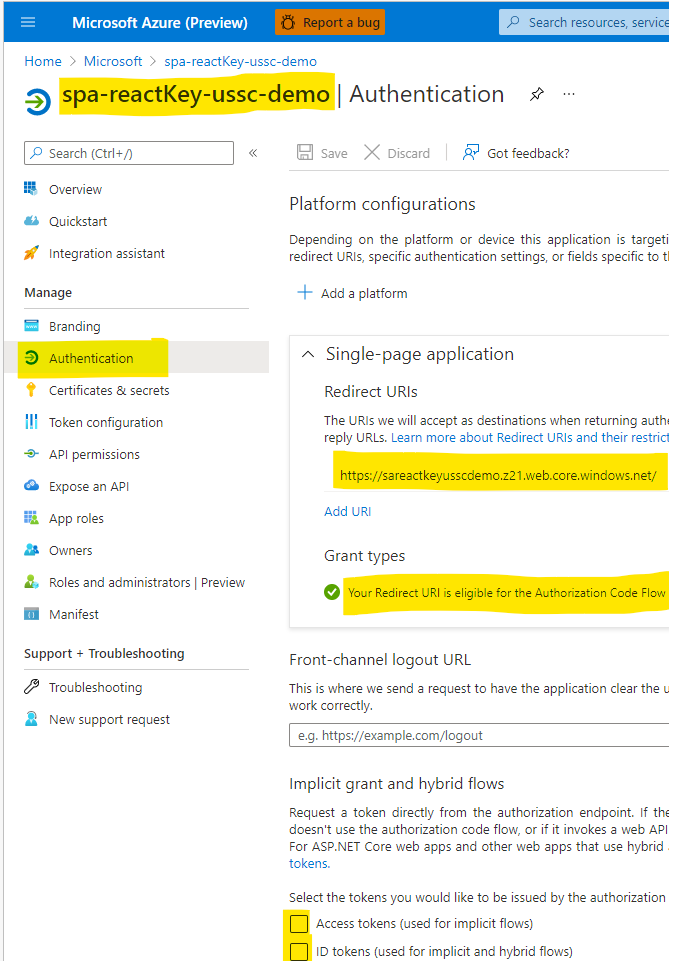
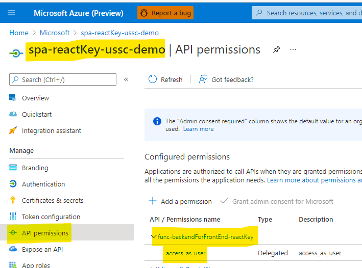

# func-reset-key

This repo shows how to use an Azure Function to regenerate or set the primary & secondary keys of an Azure API Management subscription programatically.

It also shows how to implement a "backend-for-frontend" pattern for protecting an API subscription key when using a Single Page App (React).

## How to regenerate APIM subscription keys


### How to authenticate


## Protecting API subscription key


### Backend setup

#### Azure Function setup


### Backend for front-end setup

#### Azure AD app registration setup


#### Azure Function setup


### Front-end setup

#### Azure AD app registration setup




## KeyVault setup


## Useful REST API calls

### Request access token

```shell
POST https://login.microsoftonline.com/microsoft.onmicrosoft.com/oauth2/v2.0/token
```

### Regenerate primary key

```shell
POST https://management.azure.com/subscriptions/dcf66641-6312-4ee1-b296-723bb0a999ba/resourceGroups/rg-apim-ussc-demo/providers/Microsoft.ApiManagement/service/apim-dev-ussc-demo/subscriptions/6169bbb8a952b1005f070001/regeneratePrimaryKey?api-version=2020-12-01
```

### Set primary key

```shell
PATCH https://management.azure.com/subscriptions/dcf66641-6312-4ee1-b296-723bb0a999ba/resourceGroups/rg-apim-ussc-demo/providers/Microsoft.ApiManagement/service/apim-dev-ussc-demo/subscriptions/6169bbb8a952b1005f070001?api-version=2020-12-01

{
    "properties": {
        "primaryKey": "asdf",
        "secondaryKey": "fdas"
    }
}
```

## Resources

- https://docs.microsoft.com/en-us/azure/active-directory/develop/v2-oauth2-auth-code-flow
- https://docs.microsoft.com/en-us/azure/active-directory/develop/v2-oauth2-client-creds-grant-flow
- https://docs.microsoft.com/en-us/rest/api/apimanagement/2020-12-01/subscription/regenerate-primary-key
- https://docs.microsoft.com/en-us/azure/active-directory/develop/scenario-spa-acquire-token?tabs=javascript2
- https://docs.microsoft.com/en-us/azure/api-management/howto-protect-backend-frontend-azure-ad-b2c
- https://docs.microsoft.com/en-us/azure/active-directory/develop/msal-overview